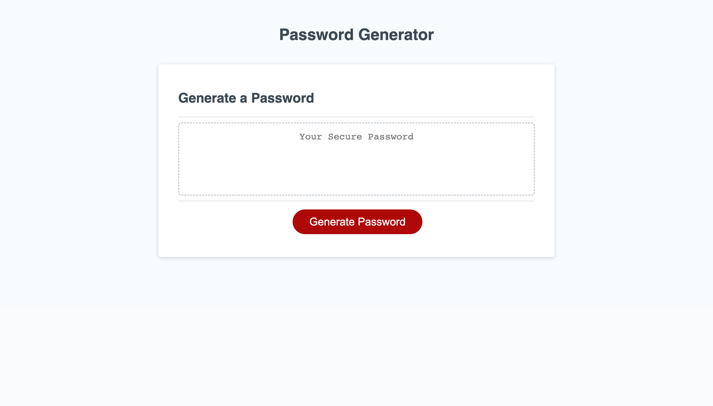

# RandomPasswordGenerator

- Here I have a random password generator that will allow the user to generate a password while excluding and including certain certain characters if they'd like 

- I did not create the CSS or HTML code. They were provided to me for this. 

- What I learned while building this was how to set variables, create and execute functions, how to use an 'eventListener', and how to properly use 'if' and 'else if' statements.

- The problem I solved was to have my generator properly respond to the prompts selected by the user so the browser can display the correct criteria for the password the user would like. 

## Usage 

- First -  deploy the link provided to access the browser https://jonathanguhl.github.io/RandomPasswordGenerator/

- Second - click on the 'Generate Password' button. You will then be asked of series of prompts. 

- Third - Type in the length that would like your password to be with a numerical input

- Four -  Answer the prompt questions to select what type of characters you will like in your password (Lower case, Upper case, Special characters, Numbers)

- Five - After you have selected the characters that you want, you will be displayed your password in the text area 

- The webpage should look like this when deployed 
 

